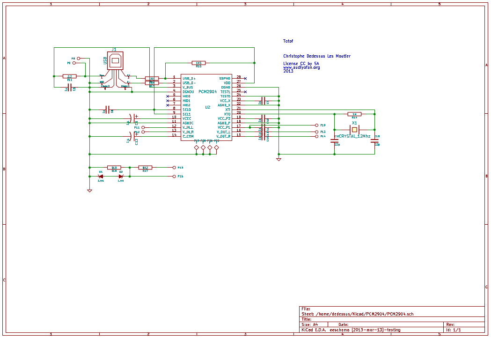
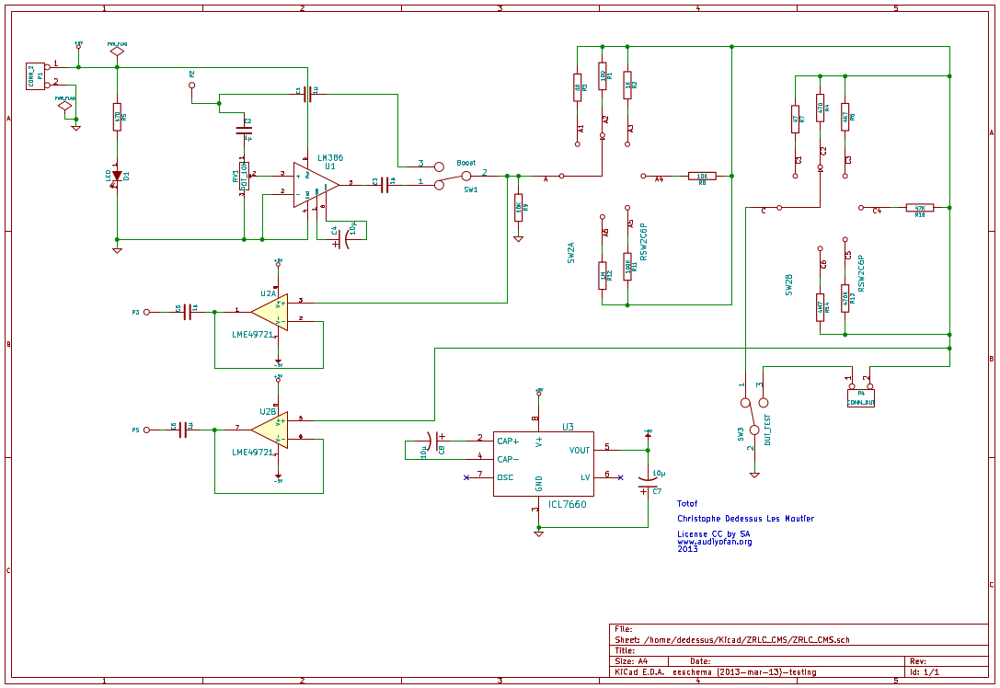

ZRLC_USB
================

A small project to measure resistance, impedance, capacitance, inductance, input impedance of
amplifier, transformers, etc 

    
If you would have more information about this project please visit 
www.audiyofan.org

A link to the dedicated post 

http://www.audiyofan.org/forum/viewtopic.php?f=57&t=8121&start=30

It's just a box connected via USB , you don't need an external sound card to measure ZRLC,

You can use VisualAnalyser or an other program, A link to the dedicated to the software

http://www.sillanumsoft.org/ZRLC.htm

Under Linux no drivers is required
Under Windows you can find in the folder "Drivers_windows" all you need to run this box properly

PCB & schema are designed with Kicad

All comments are welcome

Totof

